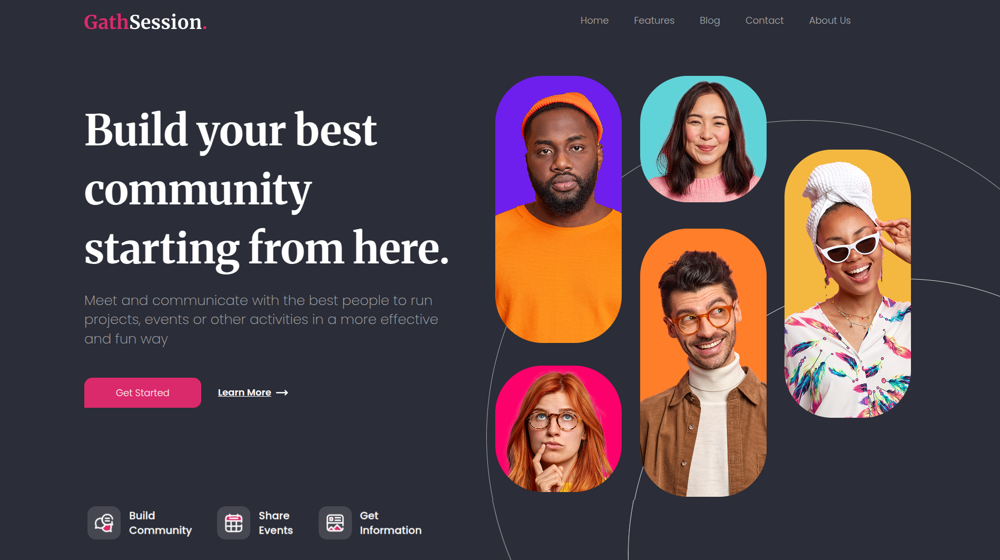

# CSS_Header-Gathsession
## 2º Proyecto CSS Header Gathsession del master Fullstack de Conquer Blocks
- Segunda tarea entregable para evaluar las habilidades de CSS aprendidas.
- El proyecto es una maquetación CSS, No Responsive, diseñada para Desktop. Podemos ver este proyecto en el siguiente enlace:
  [Header Gathsession](https://dclair.github.io/CSS_Header-Gathsession/)\
   
